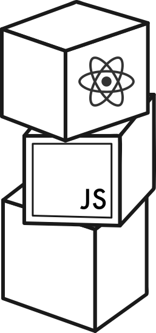

# FullstackOpen

   


This repository contains my work from the FullStackOpen course at the University of Helsinki in 2026, the solutions are organized into separate folders, each corresponding to a specific section.  
 
&nbsp;

> FullStackOpen is a free online course that teaches modern web development with JavaScript, covering React, Node.js, TypeScript, GraphQL, React Native, CI/CD, containers, and relational databases through hands-on exercises.

## Getting Started

Clone the repository:

```bash
git clone https://github.com/your-username/FullstackOpen.git
cd FullstackOpen
```

Each project is independent. Navigate to the desired project and run:

```bash
pnpm install
pnpm run dev
```

Refer to each part's README for specific setup instructions.

## My Progress

- [x] [Part 0: Fundamentals of web applications](part0)
- [x] [Part 1: Introduction to React](part1)
- [x] [Part 2: Communicating with server](part2)
- [x] [Part 3: Programming a server with NodeJS and Express](part3)
- [ ] Part 4: Testing Express servers, user administration
- [ ] Part 5: Testing React apps
- [ ] Part 6: Advanced state management
- [ ] Part 7: React router, custom hooks, styling app with CSS and webpack
- [ ] Part 8: GraphQL
- [ ] Part 9: TypeScript
- [ ] Part 10: React Native
- [ ] Part 11: CI/CD
- [ ] Part 12: Containers
- [ ] Part 13: Using relational databases

## Useful Resources

- [Full Stack Open - Official Course](https://fullstackopen.com)
- [University of Helsinki](https://www.helsinki.fi)
- [React Documentation](https://react.dev)
- [Node.js Documentation](https://nodejs.org)
- [Express Documentation](https://expressjs.com)
- [MongoDB Documentation](https://www.mongodb.com/docs)
- [PostgreSQL Documentation](https://www.postgresql.org/docs)