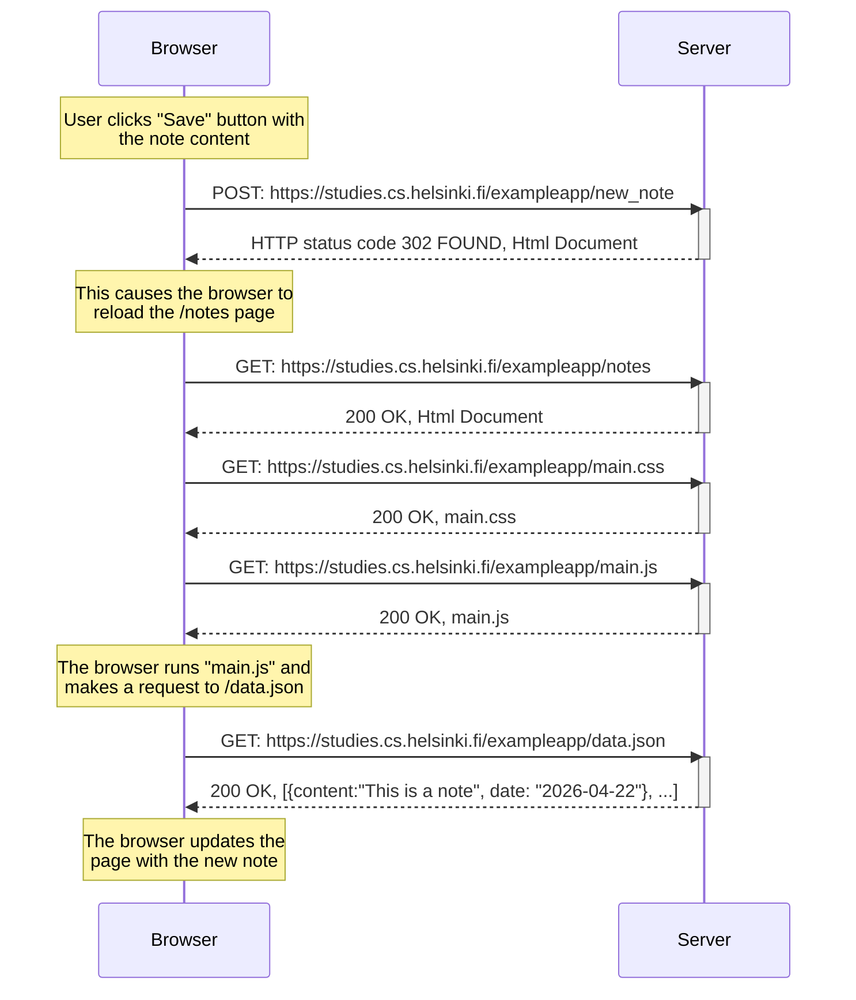

# 0.4. Creating a new note

## Description

Create a diagram showing the process of a user interacting with the “Save” button on <https://studies.cs.helsinki.fi/exampleapp/notes> with
text entered in the input field

## Solution in mermaid



## Mermaid syntax

```markdown
sequenceDiagram
participant Browser
participant Server

Note over Browser: User clicks "Save" button with <br/>the note content
Browser->>Server: POST: https://studies.cs.helsinki.fi/exampleapp/new_note
activate Server
Server-->>Browser: HTTP status code 302 FOUND, Html Document
deactivate Server

Note over Browser: This causes the browser to <br/>reload the /notes page
Browser->>Server: GET: https://studies.cs.helsinki.fi/exampleapp/notes
activate Server
Server-->>Browser: 200 OK, Html Document
deactivate Server
Browser->>Server: GET: https://studies.cs.helsinki.fi/exampleapp/main.css
activate Server
Server-->>Browser: 200 OK, main.css
deactivate Server
Browser->>Server: GET: https://studies.cs.helsinki.fi/exampleapp/main.js
activate Server
Server-->>Browser: 200 OK, main.js
deactivate Server

Note over Browser: The browser runs "main.js" and <br/>makes a request to /data.json
Browser->>Server: GET: https://studies.cs.helsinki.fi/exampleapp/data.json
activate Server
Server-->>Browser: 200 OK, [{content:"This is a note", date: "2026-04-22"}, ...]
deactivate Server
Note over Browser: The browser updates the <br/>page with the new note`
```
