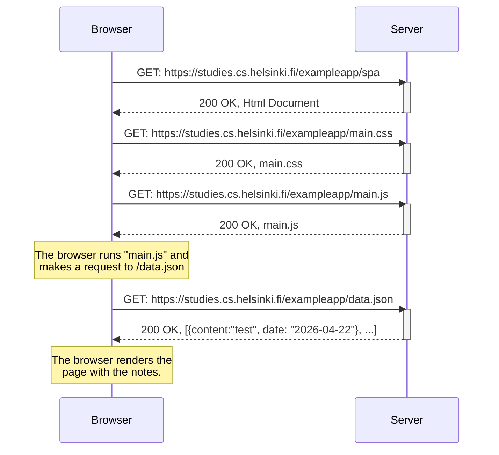

# 0.5. Single Page Application (SPA)

Esto es una prueba

## Solution in mermaid



## Mermaid syntax

```markdown
sequenceDiagram
participant Browser
participant Server
Browser->>Server: GET: https://studies.cs.helsinki.fi/exampleapp/spa
activate Server
Server-->>Browser: 200 OK, Html Document
deactivate Server
Browser->>Server: GET: https://studies.cs.helsinki.fi/exampleapp/main.css
activate Server
Server-->>Browser: 200 OK, main.css
deactivate Server
Browser->>Server: GET: https://studies.cs.helsinki.fi/exampleapp/main.js
activate Server
Server-->>Browser: 200 OK, main.js
deactivate Server

Note over Browser: The browser runs "main.js" and <br/>makes a request to /data.json
Browser->>Server: GET: https://studies.cs.helsinki.fi/exampleapp/data.json
activate Server
Server-->>Browser: 200 OK, [{content:"test", date: "2026-04-22"}, ...]
deactivate Server

Note over Browser: The browser renders the <br/>page with the notes.
```
