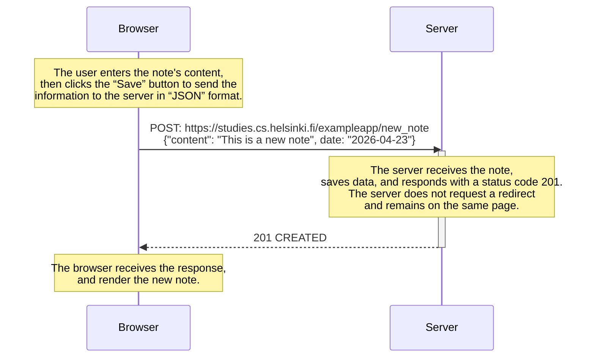

# 0.6. New Note in Single Page Application (SPA)

## Description

Create a diagram for the scenario of creating a new note
within the SPA version of the application.

## Solution in mermaid



## Mermaid syntax

```markdown
sequenceDiagram
participant Browser
participant Server

Note over Browser: The user enters the note's content, <br/>then clicks the “Save” button to send the <br/>information to the server in “JSON” format.
Browser->>Server: POST: https://studies.cs.helsinki.fi/exampleapp/new_note <br/>{"content": "This is a new note", date: "2026-04-23"}
activate Server
Note over Server: The server receives the note, <br/>saves data, and responds with a status code 201. <br/>The server does not request a redirect <br/>and remains on the same page.
Server-->>Browser: 201 CREATED
deactivate Server
Note over Browser: The browser receives the response, <br/>and render the new note.
```
